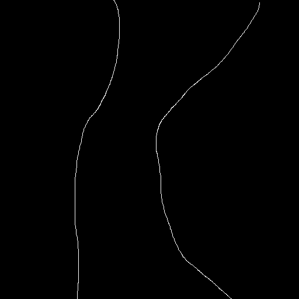
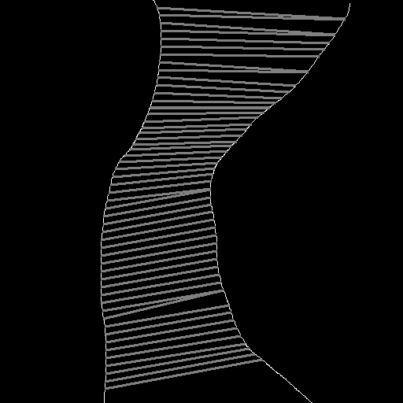

# Find Point by Point Distance Between Two Detected Edges

This is a simple project to find distant between two detected edges.
It will just find the slope at each point and after some thresholdig, it will find the distance between two points. If one of the line is vertical then it will find the distance between the point and the horizontal line. If both line have same slope with opposite sign
then it will find the distance between the points as a horizontal line. Otherwise it has
search range and finds the minimum distance between the two points.

The input image is as follows:

and it will generate an output image as follows:

